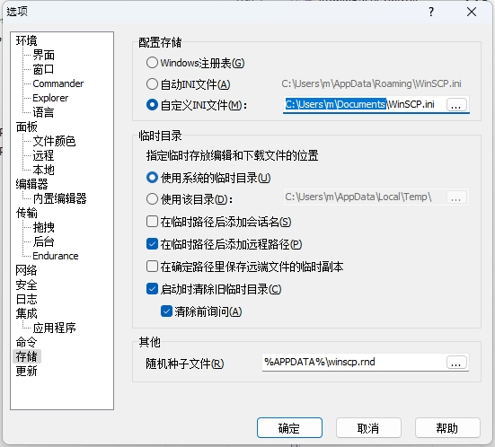

# winscp_password
解密原版的winscp密码，提取出后可以单独在自己的c++或者Qt项目中调用

# 提取出来的代码结果
Plain   : my_test_password_123_$#@

Crypted : A35C755C2E3333286D656E726D6A64726D6E726F6831250328392F28032C3D2F2F2B332E38036D6E6F03787F1C

Decrypted: my_test_password_123_$#@

# 设置密码保存为 ini

# 提取出来的代码结果

