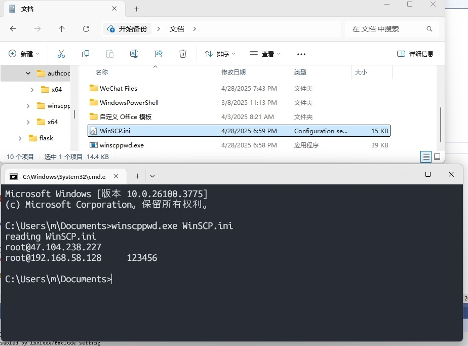

# winscp_password
解密原版的winscp密码，提取出后可以单独在自己的c++或者Qt项目中调用

# 提取出来的代码结果
Plain   : my_test_password_123_$#@

Crypted : A35C755C2E3333286D656E726D6A64726D6E726F6831250328392F28032C3D2F2F2B332E38036D6E6F03787F1C

Decrypted: my_test_password_123_$#@

# 设置密码保存为 ini


# 提取出来的代码结果



# 如何给exe签名 （windows下管理员权限运行Powersheel）

## 1.生成并导出 PFX，包含 Basic Constraints CA:TRUE 和 Code Signing EKU
```$pwd = ConvertTo-SecureString "Dqn10985$#@" -AsPlainText -Force
New-SelfSignedCertificate `
  -Subject "CN=DuQingNian" `
  -KeyExportPolicy Exportable `
  -KeySpec Signature `
  -KeyLength 2048 `
  -CertStoreLocation "Cert:\CurrentUser\My" `
  -NotAfter (Get-Date).AddYears(1) `
  -TextExtension @(
    "2.5.29.19={text}CA:true",               # Basic Constraints
    "2.5.29.37={text}1.3.6.1.5.5.7.3.3"       # EKU: Code Signing
  ) |
Export-PfxCertificate `
  -Password $pwd `
  -FilePath "D:\sign_pfx\duqingnian.pfx"```

## 2.导出cer
```Export-Certificate `
  -Cert (Get-ChildItem Cert:\CurrentUser\My `
           | Where-Object Subject -EQ 'CN=DuQingNian' `
           | Select-Object -First 1) `
  -FilePath 'D:\sign_pfx\duqingnian.cer'```


## 3.给exe签名
```& "C:\Program Files (x86)\Windows Kits\10\bin\10.0.22000.0\x64\signtool.exe" sign /f "D:\sign_pfx\duqingnian.pfx" /p Dqn10985$#@ /fd SHA256 /tr http://timestamp.digicert.com /td SHA256 "D:\projects\qt\QRcode\x64\Release\1.exe"```

## 4.添加到收信任(这一步测试没用，改为：双击duqingnian.cer 安装证书   选择本地计算机  受信任的机构)
```certutil -addstore Root D:\sign_pfx\duqingnian.cer
certutil -addstore TrustedPublisher D:\sign_pfx\duqingnian.cer```